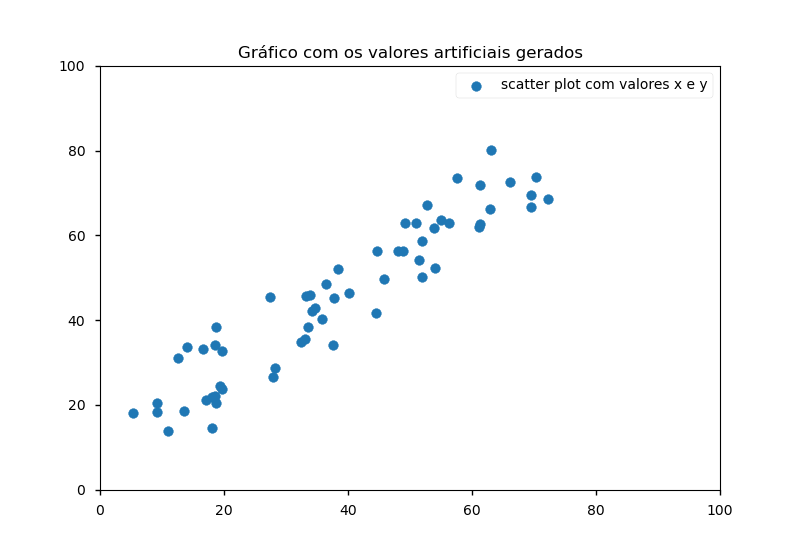

# Simple_Flask_API
📎Simples API REST para servir como start no estudo sobre como colocar um modelo de ML em produção. utilizando as tecnologias:
-  [👉flask](https://flask.palletsprojects.com/en/1.1.x/)
- [👉flask_restful](https://flask-restful.readthedocs.io/en/latest/quickstart.html)
- [👉numpy](https://numpy.org/install/)
- [👉matplotlib](https://matplotlib.org/gallery/index.html#)
- [👉sklearn](https://scikit-learn.org/stable/getting_started.html)
- [👉pickle](https://scikit-learn.org/stable/modules/model_persistence.html)

📎Produzindo um simples regressão linear com sklearn.

